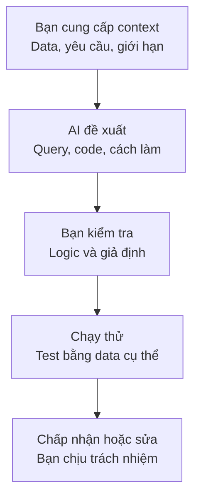

AI có thể viết một câu SQL trong vài giây, giải thích error message và tạo sẵn một **Data Pipeline** (luồng xử lý data). Vậy người mới còn cần học những kiến thức nền tảng không?

Câu trả lời của mình là có.

**AI** (trí tuệ nhân tạo) là một assistant rất hữu ích. Nó giúp mình đi nhanh hơn, nhưng không chịu trách nhiệm khi report sai doanh thu, pipeline tạo data trùng hay thông tin khách hàng bị đưa nhầm cho người không nên xem.

Điểm khó là câu trả lời sai của AI thường trông khá hợp lý. Code có thể chạy thành công, câu giải thích có vẻ tự tin và dashboard vẫn hiện ra một con số. Nếu không hiểu phần nền tảng, mình không có cách nào biết nên tin phần nào.



## Code chạy được vẫn có thể cho kết quả sai

Giả sử bảng `orders` có một đơn hàng:

| order_id | total_amount |
| --- | ---: |
| ORD-1042 | 120,000 |

Bảng `order_items` có hai món thuộc đơn đó:

| order_id | item |
| --- | --- |
| ORD-1042 | Cơm gà |
| ORD-1042 | Nước cam |

Bạn nhờ AI tính tổng doanh thu sau khi nối hai bảng. Nó có thể đưa ra một query chạy hoàn toàn hợp lệ:

```sql
SELECT SUM(o.total_amount) AS revenue
FROM orders o
JOIN order_items i ON o.order_id = i.order_id;
```

Kết quả là `240,000`, trong khi doanh thu thật chỉ có `120,000`. Vì một order nối với hai item, `total_amount` đã bị tính hai lần.

AI không thể tự biết `total_amount` đang ở cấp order hay item nếu mình không nói rõ. Kiến thức về **Grain** (mỗi row đại diện cho điều gì) và SQL JOIN giúp mình phát hiện vấn đề này.

## Pipeline chạy lại có thể làm data bị trùng

AI có thể viết một chương trình đọc file đơn hàng rồi `INSERT` tất cả row vào **Database** (cơ sở dữ liệu). Lần đầu chương trình chạy đúng:

| Lần chạy | Số order trong file | Số row trong bảng sau khi chạy |
| --- | ---: | ---: |
| Lần 1 | 1,000 | 1,000 |

Pipeline bị lỗi ở bước sau nên bạn chạy lại. Nếu code không xử lý việc chạy lại, kết quả có thể thành:

| Lần chạy | Số order trong file | Số row trong bảng sau khi chạy |
| --- | ---: | ---: |
| Lần 2 | 1,000 | 2,000 |

Để review đoạn code đó, mình cần hiểu **Idempotency** (khả năng chạy lại mà không tạo thêm kết quả ngoài ý muốn), **Primary Key** (khoá chính giúp nhận diện mỗi row) và cách cập nhật data đã tồn tại. Prompt tốt hơn có thể yêu cầu AI thiết kế pipeline an toàn khi chạy lại, nhưng mình vẫn cần test để xác nhận.

## AI không biết hết context của công ty

Bạn hỏi AI: “Một đơn hàng bị huỷ là gì?”. Nó có thể đưa ra một định nghĩa hợp lý, nhưng hệ thống của công ty lại có nhiều trường hợp:

| Trạng thái | Có tính là đơn bị huỷ không? |
| --- | --- |
| Khách huỷ trước khi nhà hàng nhận | Tuỳ định nghĩa business |
| Nhà hàng từ chối | Có thể có |
| Thanh toán thất bại | Có thể chưa được tính là một order |
| Hệ thống đóng đơn test | Cần loại khỏi report |

Những quy tắc này không nằm sẵn trong AI. Data Engineer vẫn phải hỏi Operations, Product hoặc Backend team, rồi cung cấp context đó cho AI.

Một câu trả lời đúng trên internet chưa chắc đúng với data của công ty mình.

## Giải pháp phức tạp chưa chắc là giải pháp tốt

Nếu hỏi cách xây pipeline “có thể scale”, AI có thể đề xuất nhiều công nghệ cùng lúc. Nhưng một report cập nhật mỗi sáng từ vài nghìn order có thể chỉ cần một chương trình nhỏ chạy theo lịch và một Data Warehouse.

| Câu hỏi cần trả lời trước | Vì sao quan trọng? |
| --- | --- |
| Có bao nhiêu data? | Biết một máy đã đủ xử lý hay chưa |
| Người dùng cần data lúc nào? | Biết pipeline chạy theo lịch có đáp ứng không |
| Nếu trễ một giờ thì sao? | Biết mức độ tin cậy thật sự cần thiết |
| Team có thể vận hành công nghệ nào? | Tránh xây hệ thống không ai bảo trì được |

Kiến thức về Database, **Data Warehouse** (kho dữ liệu) và **Distributed Systems** (hệ thống phân tán) giúp mình đánh giá đề xuất của AI thay vì chọn kiến trúc chỉ vì nó nghe hiện đại.

## AI giúp Data Engineer làm gì tốt hơn?

Khi dùng đúng chỗ, AI tiết kiệm khá nhiều thời gian:

| Công việc | AI có thể giúp | Mình vẫn cần kiểm tra |
| --- | --- | --- |
| Viết SQL | Tạo query đầu tiên | JOIN, Grain và kết quả trên data thật |
| Viết code pipeline | Tạo cấu trúc và xử lý trường hợp phổ biến | Chạy lại, lỗi giữa chừng và data thiếu |
| Đọc error | Giải thích log và gợi ý nguyên nhân | Gợi ý có khớp với hệ thống đang chạy không |
| Viết test | Liệt kê một số trường hợp cần kiểm tra | Các trường hợp đặc biệt của business |
| Viết tài liệu | Tạo bản nháp từ code | Tên field, owner và quy tắc có đúng không |
| Học kiến thức mới | Giải thích theo ví dụ và trả lời câu hỏi tiếp theo | Kiểm tra lại bằng tài liệu chính thức |

AI làm tốt phần tạo bản nháp và mở rộng lựa chọn. Data Engineer vẫn phải hiểu yêu cầu, kiểm tra giả định và xác nhận kết quả.

## Một cách làm việc thực tế với AI

### 1. Nói rõ bài toán

Cho AI biết cấu trúc table, một vài row mẫu, kết quả mong muốn và giới hạn của hệ thống. Đừng chỉ hỏi “viết giúp tôi một pipeline tốt”.

### 2. Yêu cầu AI nói ra giả định

Ví dụ: mỗi `order_id` có duy nhất không, timezone nào đang được dùng, pipeline có cần chạy lại hay không. Giả định càng rõ, mình càng dễ kiểm tra.

### 3. Bắt đầu bằng ví dụ nhỏ

Dùng vài row mà mình có thể tự tính bằng tay. Với ví dụ doanh thu ở trên, mình biết đáp án phải là `120,000` trước khi chạy query.

### 4. Kiểm tra trường hợp không đẹp

Thử data trùng, field bị thiếu, giá trị bằng `NULL`, pipeline lỗi giữa chừng hoặc Source System đổi cấu trúc. Production hiếm khi chỉ có data đẹp như ví dụ.

### 5. Đọc phần mình chuẩn bị sử dụng

Nếu không giải thích được đoạn code đang làm gì, mình chưa nên đưa nó vào production. Có thể tiếp tục hỏi AI từng phần, đọc tài liệu gốc hoặc nhờ đồng đội review.

## Nên học gì khi đã có AI?

AI làm thay đổi cách học, nhưng chưa làm các kiến thức nền tảng mất đi giá trị:

- SQL để kiểm tra logic và kết quả.
- Database để hiểu data được lưu, thay đổi và truy vấn ra sao.
- Data Warehouse và **Data Modeling** (mô hình hoá data) để biết đầu ra nên được tổ chức thế nào.
- Data Pipeline để hiểu data di chuyển và có thể hỏng ở đâu.
- **Data Quality** (chất lượng data) để xác định thế nào là data đủ tin cậy.
- **Monitoring** (theo dõi hệ thống) để biết hệ thống đang hoạt động hay chỉ trông có vẻ đang hoạt động.

Bạn không cần nhớ mọi cú pháp. AI rất giỏi hỗ trợ phần đó. Phần đáng học sâu là những nguyên tắc giúp mình đặt câu hỏi đúng và nhận ra một kết quả sai.

## Tóm lại

AI có thể là một assistant rất nhanh, nhưng tốc độ không thay thế được khả năng đánh giá. Kiến thức nền tảng giúp Data Engineer cung cấp context tốt hơn, kiểm tra câu trả lời và chịu trách nhiệm cho kết quả cuối cùng.

Mục tiêu không phải làm mọi thứ mà không dùng AI. Mục tiêu là dùng AI mà vẫn biết mình đang làm gì.
