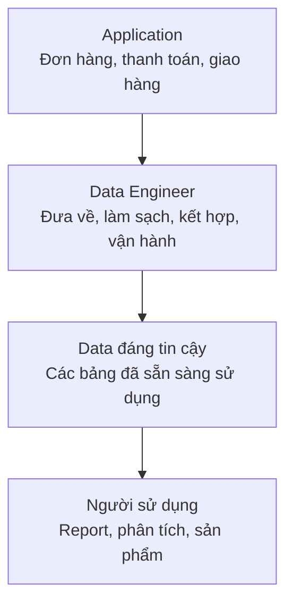
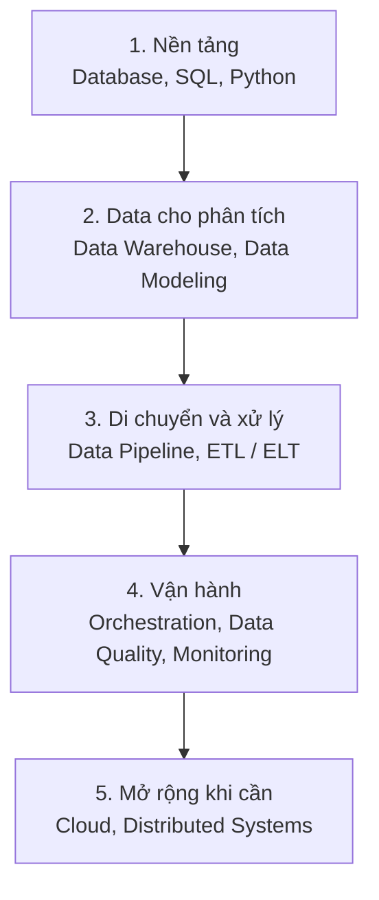

**Data Engineer** (kỹ sư dữ liệu) là người xây dựng và vận hành hệ thống đưa data từ nơi nó được tạo ra đến nơi nó có thể được sử dụng.

Nghe vẫn hơi chung chung, nên mình thử bắt đầu bằng một đơn hàng.

Bạn đặt một phần cơm trên ứng dụng. Đơn hàng được lưu trong MySQL, kết quả thanh toán nằm ở một hệ thống khác, còn thông tin giao hàng lại nằm ở hệ thống của tài xế. Đây là các **Source System** (hệ thống nguồn). Công ty muốn biết hôm nay có bao nhiêu đơn, doanh thu là bao nhiêu và nhà hàng nào thường giao trễ.

Data đã có, nhưng đang nằm rải rác. Data Engineer lo phần ở giữa:

Data Engineer không tạo ra đơn hàng và cũng không phải người quyết định nhà hàng nào hoạt động tốt. Họ xây con đường giúp data đi từ application đến những người cần nó.

## Data Engineer làm những gì?

Phạm vi công việc khác nhau ở mỗi công ty, nhưng thường có năm phần chính.

### Xây Data Pipeline

**Data Pipeline** (luồng xử lý đưa data qua nhiều bước) lấy data từ application, **Database** (cơ sở dữ liệu), file hoặc **API** (cách hai hệ thống trao đổi với nhau) rồi đưa về nền tảng data.

Ví dụ, một pipeline có thể sao chép các đơn hàng mới từ MySQL sau mỗi năm phút:

| Source | Pipeline làm gì? | Kết quả |
| --- | --- | --- |
| Bảng `orders` trong MySQL | Lấy các row mới hoặc vừa thay đổi | Đơn hàng xuất hiện trong nền tảng data |

Pipeline cần chạy nhiều lần mà không bỏ sót hoặc tạo thêm đơn hàng giả.

### Tổ chức Data Storage

**Data Storage** (nơi lưu trữ data) có thể là **Data Warehouse** (kho dữ liệu), **Data Lake** (hồ dữ liệu) hoặc một database dành cho phân tích. Data Engineer chọn cách chia bảng, định dạng và thời gian lưu giữ để data có thể được tìm thấy và sử dụng lại.

Trong ví dụ đặt đồ ăn, data có thể được tách thành:

| Bảng | Chứa gì? |
| --- | --- |
| `orders` | Đơn hàng, thời gian đặt và trạng thái |
| `payments` | Số tiền và kết quả thanh toán |
| `restaurants` | Tên, khu vực và thông tin nhà hàng |
| `deliveries` | Tài xế và thời gian giao hàng |

### Làm Data Transformation

**Data Transformation** (biến đổi data) biến các row rời rạc thành data dễ sử dụng hơn. Pipeline có thể chuẩn hoá thời gian, loại row trùng rồi ghép bốn bảng trên bằng `order_id`.

Đầu vào nằm trong nhiều bảng:

| Bảng | Field | Giá trị của ORD-1042 |
| --- | --- | --- |
| `orders` | `order_id` | ORD-1042 |
| `payments` | `payment_status` | paid |
| `restaurants` | `restaurant_name` | Cơm Nhà |
| `deliveries` | `delivered_at` | 12:32 |

Đầu ra có thể là một bảng đã tính sẵn:

| order_id | revenue | delivery_minutes | delivered_on_time |
| --- | ---: | ---: | --- |
| ORD-1042 | 120,000 | 30 | yes |

Data Analyst không cần tự ghép lại các hệ thống mỗi lần làm report.

### Giữ Data Quality

**Data Quality** (chất lượng data) trả lời câu hỏi: data này có đủ đúng để sử dụng không?

Data Engineer có thể thêm các kiểm tra đơn giản:

| Kiểm tra | Điều muốn phát hiện |
| --- | --- |
| `order_id` không được để trống | Đơn hàng không thể nhận diện |
| Một `order_id` chỉ xuất hiện một lần | Data bị trùng |
| `total_amount` không được âm | Giá trị không hợp lệ |
| Số đơn hôm nay không giảm bất thường | Pipeline có thể đang thiếu data |

Một dashboard đẹp không có nhiều ý nghĩa nếu số liệu phía sau sai.

### Vận hành và theo dõi

Đưa pipeline lên chạy chưa phải là xong. **Monitoring** (theo dõi hệ thống) giúp team biết pipeline có chạy đúng giờ, có lỗi và data có đến đủ hay không.

Ví dụ, pipeline đơn hàng thường hoàn tất lúc 7 giờ sáng nhưng hôm nay đến 8 giờ vẫn chưa xong. Data Engineer cần tìm nguyên nhân, sửa lỗi, chạy bù phần data còn thiếu rồi kiểm tra report đã trở lại bình thường chưa.

Đây là phần ít xuất hiện trong các bài demo, nhưng lại chiếm khá nhiều thời gian khi làm việc thật.

## Một ngày làm việc có thể như thế nào?

Không có ngày nào giống hệt ngày nào. Một ngày tương đối bình thường có thể gồm:

| Thời điểm | Việc đang xảy ra |
| --- | --- |
| 09:00 | Kiểm tra các pipeline đêm qua và xử lý một pipeline bị lỗi |
| 10:30 | Làm cùng Data Analyst để thống nhất cách tính “đơn giao trễ” |
| 13:30 | Viết code bổ sung data thanh toán vào bảng đơn hàng |
| 15:30 | Review thay đổi của đồng đội và triển khai pipeline |
| 16:30 | Kiểm tra thời gian chạy và chi phí của pipeline |

Công việc có cả code, hiểu data, xử lý sự cố và trao đổi với những team khác.

## Khác Data Analyst và Data Scientist ở đâu?

Ba vai trò cùng làm việc với data nhưng thường chịu trách nhiệm cho những phần khác nhau:

| Vai trò | Câu hỏi chính | Ví dụ đầu ra |
| --- | --- | --- |
| **Data Engineer** | Làm sao để data đầy đủ, đúng và đến đúng lúc? | Pipeline và bảng đơn hàng đã được làm sạch |
| **Data Analyst** (chuyên viên phân tích dữ liệu) | Data cho biết điều gì đang xảy ra? | Report (báo cáo) về tỷ lệ giao trễ theo nhà hàng |
| **Data Scientist** (nhà khoa học dữ liệu) | Có thể dự đoán điều gì sẽ xảy ra? | Model (mô hình) dự đoán thời gian giao hàng |

Đây chỉ là cách phân chia để dễ hình dung. Ở công ty nhỏ, một người có thể vừa xây pipeline vừa làm report. Ở công ty lớn, trách nhiệm thường được chia rõ hơn.

Khi đọc một job description, đừng chỉ nhìn chức danh. Hãy xem mình sẽ xây hệ thống nào, chịu trách nhiệm cho data nào và ai sẽ dùng đầu ra đó.

## Data Engineer cần biết gì?

Bạn chưa cần học mọi công nghệ để bắt đầu. Thay vì xem đây là một thứ tự cứng, có thể chia kiến thức thành năm lớp:

**Database** và SQL nên đi cùng nhau: một bên giúp bạn hiểu data được lưu ra sao, bên còn lại giúp bạn đọc và kiểm tra data đó. Python cho bạn cách viết chương trình thay vì xử lý mọi thứ bằng tay.

Sau phần nền tảng, **Data Warehouse** giúp bạn hiểu nơi data dùng cho phân tích được tổ chức như thế nào. Đây cũng là lúc học **Data Modeling** (mô hình hoá data), đặc biệt là cách thiết kế bảng để trả lời câu hỏi business.

Khi đã hiểu data bắt đầu ở đâu và cần đi đến đâu, Data Pipeline cùng **ETL / ELT** (các bước lấy, biến đổi và đưa data vào nơi lưu trữ) sẽ dễ hình dung hơn. Sau đó mới đến **Orchestration** (điều phối pipeline), Data Quality và Monitoring để hệ thống chạy ổn định.

**Cloud** (điện toán đám mây) và **Distributed Systems** (hệ thống phân tán) quan trọng khi hệ thống lớn lên, nhưng không phải điều kiện để bạn làm pipeline đầu tiên. Công cụ nào cũng chỉ nên được học khi bạn hiểu nó đang giải quyết vấn đề gì.

## Tóm lại

Data Engineer giúp biến data đang nằm rải rác thành data mà người khác có thể tìm thấy, hiểu và tin tưởng sử dụng. Họ xây pipeline, tổ chức nơi lưu trữ, biến đổi data, kiểm tra chất lượng và giữ cho hệ thống tiếp tục chạy khi có sự cố.
