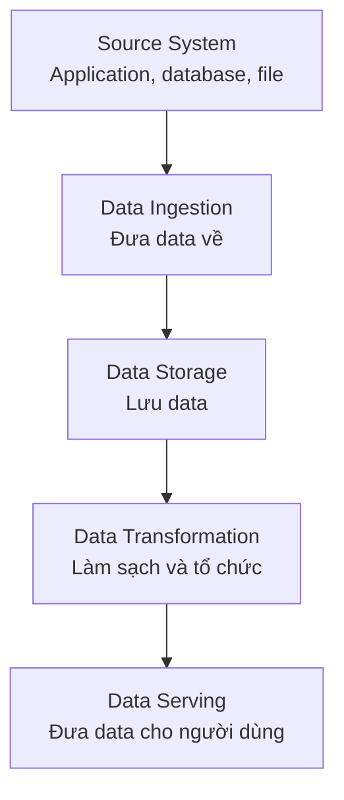
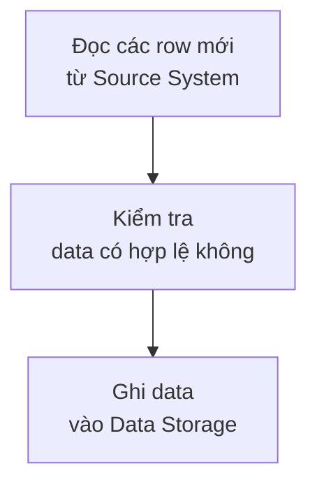
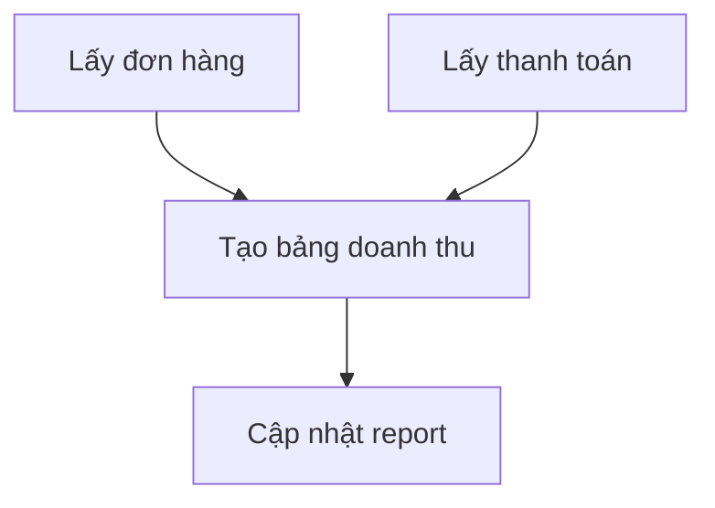
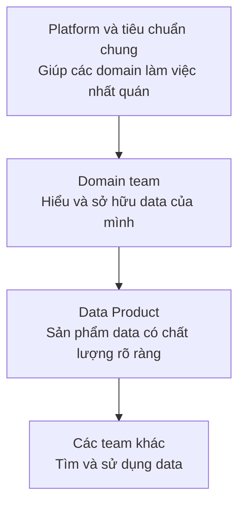

Nếu Data Engineer là người xây hệ thống, vậy họ xây những hệ thống nào?

Câu trả lời tuỳ vào công ty. Một cửa hàng có vài nghìn đơn mỗi ngày không cần kiến trúc giống một ứng dụng đang phục vụ hàng triệu người. Tuy vậy, phần lớn hệ thống data đều được ghép từ những phần quen thuộc dưới đây.

Đây là sơ đồ khái quát. Một hệ thống thật có thể đơn giản hơn, phức tạp hơn hoặc thực hiện vài bước cùng một lúc.

## Hệ thống Data Ingestion

**Data Ingestion** (thu thập và đưa data vào hệ thống) kết nối **Source System** (hệ thống nguồn) với nơi lưu trữ dành cho data.

Với ứng dụng giao đồ ăn, các Source System có thể là:

| Source System | Data đang nằm ở đó |
| --- | --- |
| MySQL của application | Đơn hàng và nhà hàng |
| Hệ thống thanh toán | Số tiền và trạng thái thanh toán |
| Hệ thống giao hàng | Tài xế và trạng thái giao hàng |

Một **Data Pipeline** (luồng xử lý đưa data qua nhiều bước) có thể sao chép data từ ba nơi này sau mỗi năm phút. Ở giai đoạn đầu, chỉ cần hiểu pipeline như một chương trình được chạy lặp lại:

Pipeline cần nhớ nó đã đọc đến đâu. Nếu lần nào chạy cũng lấy lại toàn bộ data, hệ thống vừa chậm vừa dễ tạo bản ghi trùng.

## Hệ thống Data Storage

**Data Storage** (nơi lưu trữ data) không chỉ có một loại.

| Nơi lưu trữ | Dùng chủ yếu cho việc gì? | Ví dụ |
| --- | --- | --- |
| **Database** (cơ sở dữ liệu) | Giúp application đọc và ghi data khi người dùng thao tác | MySQL lưu đơn hàng |
| **Data Warehouse** (kho dữ liệu) | Lưu data đã được tổ chức để phân tích và làm report | Bảng doanh thu theo ngày |
| **Data Lake** (hồ dữ liệu) | Giữ nhiều data gốc, kể cả file và các định dạng khác nhau | File lịch sử đơn hàng |

Người mới thường nhầm Database và Data Warehouse vì cả hai đều có table và đều dùng SQL. Khác biệt nằm ở công việc chính: Database giúp application vận hành, còn Data Warehouse được thiết kế để phân tích data từ nhiều nguồn.

Một công ty nhỏ có thể bắt đầu bằng MySQL cho application và một Data Warehouse cho report. Data Lake chỉ cần xuất hiện khi công ty có lý do rõ ràng để giữ nhiều data gốc hoặc nhiều loại file.

## Hệ thống Data Transformation

**Data Transformation** (biến đổi data) biến data gần với application thành data gần với câu hỏi business.

Trong Source System, một đơn hàng có thể nằm ở bốn bảng:

| Bảng nguồn | Data cần dùng |
| --- | --- |
| `orders` | Mã đơn và thời gian đặt |
| `payments` | Số tiền đã thanh toán |
| `restaurants` | Tên và khu vực nhà hàng |
| `deliveries` | Thời điểm giao thành công |

Hệ thống transformation ghép chúng thành một bảng dễ sử dụng hơn:

| order_id | order_date | restaurant | revenue | delivery_minutes |
| --- | --- | --- | ---: | ---: |
| ORD-1042 | 2026-09-06 | Cơm Nhà | 120,000 | 30 |

Đây cũng là nơi team thống nhất `revenue` nghĩa là gì. Nếu mỗi report tự tính một kiểu, công ty sẽ có nhiều con số doanh thu cho cùng một ngày.

## Hệ thống Orchestration

Khi có một pipeline, bạn có thể tự chạy nó. Khi có nhiều pipeline phụ thuộc nhau, cần **Orchestration** (điều phối các bước xử lý).

Report chỉ nên được cập nhật sau khi data đơn hàng và thanh toán đã về đầy đủ:

Orchestration đảm bảo các bước chạy đúng thứ tự, ghi lại bước nào thất bại và cho phép chạy lại từ chỗ cần thiết. Airflow là một công cụ có thể làm việc này, nhưng người mới nên hiểu bài toán phụ thuộc trước khi học công cụ.

## Hệ thống Data Serving

**Data Serving** (đưa data cho người hoặc hệ thống sử dụng) là đoạn cuối của đường đi. Cùng bảng đơn hàng đã xử lý có thể phục vụ nhiều đầu ra:

| Người sử dụng | Đầu ra họ cần |
| --- | --- |
| Đội vận hành | Report đơn giao trễ theo nhà hàng |
| Đội tài chính | Bảng đối soát số tiền đã thanh toán |
| Quản lý | Dashboard doanh thu theo ngày |
| Application | Cảnh báo khi một đơn chờ quá lâu |

Nếu không biết ai sẽ sử dụng đầu ra, team rất dễ xây một hệ thống có nhiều công nghệ nhưng không giải quyết được câu hỏi nào.

## Hệ thống theo dõi và bảo vệ data

Các phần phía trên chỉ hữu ích khi chúng tiếp tục hoạt động. **Monitoring** (theo dõi hệ thống) và **Data Quality** (chất lượng data) giúp team phát hiện vấn đề trước khi người dùng nhìn thấy một report sai.

| Câu hỏi cần theo dõi | Vấn đề có thể xảy ra |
| --- | --- |
| Pipeline có chạy đúng giờ không? | Report hôm nay vẫn đang dùng data hôm qua |
| Số row có giảm bất thường không? | Một Source System chưa gửi đủ data |
| Có `order_id` bị trùng không? | Pipeline đã sao chép cùng một đơn nhiều lần |
| Ai được xem thông tin khách hàng? | Data cá nhân bị truy cập sai mục đích |
| Hệ thống đang tốn bao nhiêu tiền? | Một pipeline chạy đúng nhưng quá đắt |

Phân quyền, bảo mật, lịch sử thay đổi và chi phí thường ít xuất hiện trong demo. Khi hệ thống đi vào production, chúng trở thành một phần của công việc.

## Khi công ty lớn lên: Data Mesh

Ở một công ty nhỏ, một data team trung tâm có thể quản lý tất cả pipeline và table. Khi công ty có nhiều mảng kinh doanh, cách này dễ trở thành điểm nghẽn. Team trung tâm phải hiểu đơn hàng, thanh toán, giao hàng và nhiều domain khác cùng lúc.

**Data Mesh** (cách tổ chức data theo nhiều domain có quyền sở hữu rõ ràng) là một hướng tiếp cận cho vấn đề này. Thay vì giao toàn bộ data cho một team trung tâm, team hiểu rõ một domain sẽ chịu trách nhiệm cho data của domain đó.

Trong ứng dụng giao đồ ăn, trách nhiệm có thể được chia như sau:

| Domain | Data Product | Team chịu trách nhiệm |
| --- | --- | --- |
| Order | Đơn hàng và lịch sử trạng thái | Order team |
| Payment | Giao dịch và kết quả đối soát | Payment team |
| Delivery | Chuyến giao hàng và thời gian giao | Delivery team |

**Data Product** (sản phẩm data) có người chịu trách nhiệm, tài liệu hướng dẫn, quy tắc chất lượng và cách truy cập rõ ràng. Các team khác có thể sử dụng nó mà không cần đoán từng field có nghĩa gì.

Data Mesh dựa trên bốn nguyên tắc:

| Nguyên tắc | Hiểu đơn giản |
| --- | --- |
| Domain ownership (sở hữu theo domain) | Team hiểu domain chịu trách nhiệm cho data của domain đó |
| Data as a product (data như một sản phẩm) | Data được chăm sóc như một sản phẩm có người sử dụng |
| Self-serve data platform (nền tảng data tự phục vụ) | Platform team cung cấp công cụ chung để các domain tự làm việc |
| Federated governance (quản trị liên kết) | Các domain có quyền tự chủ nhưng vẫn tuân theo tiêu chuẩn chung |

Data Mesh không phải một phần mềm có thể cài đặt và cũng không mặc nhiên phù hợp với mọi công ty lớn. Nó đòi hỏi thay đổi cả kiến trúc, trách nhiệm của các team và cách quản trị data. Nếu công ty chỉ có vài nguồn data và một team trung tâm vẫn phục vụ tốt, Data Mesh có thể tạo thêm nhiều việc hơn giá trị.

Khái niệm này được Zhamak Dehghani trình bày chi tiết trong [Data Mesh Principles and Logical Architecture](https://martinfowler.com/articles/data-mesh-principles.html).

## Streaming có phải lúc nào cũng cần không?

**Streaming** (xử lý data liên tục khi data xuất hiện) phù hợp khi kết quả cần được cập nhật trong vài giây, chẳng hạn vị trí tài xế trên bản đồ. Report doanh thu cuối ngày có thể chỉ cần pipeline chạy theo lịch.

| Nhu cầu | Cách đơn giản phù hợp |
| --- | --- |
| Report doanh thu mỗi sáng | Pipeline chạy một lần mỗi đêm |
| Dashboard vận hành cập nhật mỗi 15 phút | Pipeline chạy mỗi 15 phút |
| Vị trí tài xế trên bản đồ | Streaming |

Không cần chọn Streaming chỉ vì nó nghe hiện đại hơn. Hệ thống đơn giản nhất đáp ứng được thời gian người dùng cần thường là lựa chọn dễ xây và dễ vận hành hơn.

## Tóm lại

Data Engineer có thể làm việc với Data Ingestion, Data Storage, Data Transformation, Orchestration, Data Serving và hệ thống theo dõi. Không phải Data Engineer nào cũng tự xây tất cả những phần này, nhưng họ cần hiểu data đi qua chúng như thế nào.

Điểm bắt đầu không phải là chọn thật nhiều công nghệ. Hãy bắt đầu bằng ba câu hỏi: data đến từ đâu, ai cần dùng nó và họ cần nó vào lúc nào.
