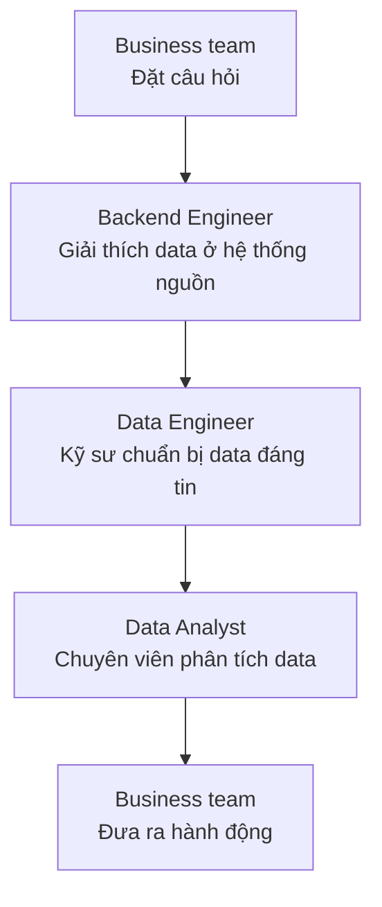
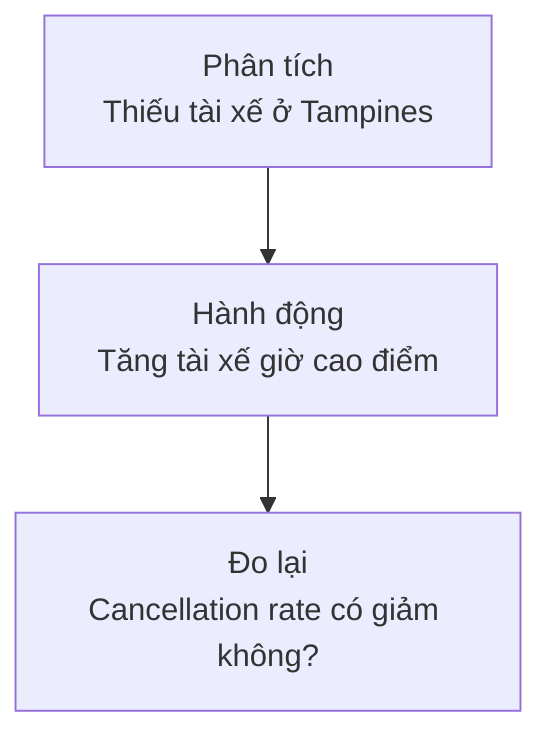

Sơ đồ tổ chức thường vẽ mỗi vai trò trong một ô riêng. Công việc thật lại diễn ra ở những chỗ các ô nối với nhau.

Giả sử đội vận hành nhận thấy số đơn bị huỷ tăng trong tuần vừa rồi. Họ muốn biết nguyên nhân để quyết định nên làm việc với nhà hàng, cải thiện việc tìm tài xế hay sửa application.

Để đi từ câu hỏi đến hành động, nhiều team phải cùng góp một phần:

Đây không phải quy trình cứng. Mọi người có thể trao đổi qua lại nhiều lần khi phát hiện câu hỏi hoặc data chưa rõ.

## Business team đặt đúng câu hỏi

**Business team** (team hiểu hoạt động kinh doanh) có thể là đội vận hành, tài chính, marketing hoặc sản phẩm. Trong ví dụ này, đội vận hành biết một đơn bị huỷ có nhiều nguyên nhân:

| cancellation_reason | Ý nghĩa |
| --- | --- |
| `customer_cancelled` | Khách hàng tự huỷ |
| `restaurant_rejected` | Nhà hàng từ chối đơn |
| `no_driver_found` | Không tìm được tài xế |
| `system_cancelled` | Hệ thống tự đóng đơn |

Nếu chỉ hỏi “Tại sao đơn bị huỷ nhiều?”, mỗi người có thể hiểu theo một cách. Một câu hỏi rõ hơn là:

> Trong bảy ngày vừa rồi, **Cancellation Rate** (tỷ lệ đơn bị huỷ) tăng ở khu vực nào và nguyên nhân nào đóng góp nhiều nhất?

Cancellation Rate cũng cần được định nghĩa: số đơn bị huỷ chia cho tất cả đơn đã tạo, hay chỉ chia cho những đơn nhà hàng đã nhận? Business team và Data Analyst phải thống nhất điều này trước khi tính.

## Backend Engineer giải thích data ở nguồn

**Backend Engineer** (kỹ sư xây phần xử lý phía sau application) biết trạng thái đơn hàng được ghi vào MySQL lúc nào và application cho phép chuyển trạng thái ra sao.

Một row trong bảng `orders` có thể trông như sau:

| order_id | area | status | cancellation_reason | updated_at |
| --- | --- | --- | --- | --- |
| ORD-1042 | Tampines | cancelled | no_driver_found | 2026-09-06 12:20 |

Data Engineer cần hỏi Backend Engineer những điều không thể nhìn ra chỉ từ tên field:

- `cancellation_reason` có luôn được điền khi `status` là `cancelled` không?
- Một đơn đã huỷ có thể được mở lại không?
- `updated_at` dùng timezone nào?
- Team sẽ báo cho ai nếu đổi tên hoặc xoá một field?

Những thống nhất về cấu trúc, ý nghĩa và cách thay đổi data thường được gọi là **Data Contract** (cam kết giữa bên tạo và bên sử dụng data). Với người mới, chỉ cần hiểu rằng hai team phải thống nhất trước khi âm thầm thay đổi data của nhau.

## Data Engineer chuẩn bị data đáng tin

**Data Engineer** (kỹ sư dữ liệu) đưa bảng đơn hàng về **Data Warehouse** (kho dữ liệu), kiểm tra data rồi tạo một bảng phù hợp cho việc phân tích.

Ví dụ, Source System chứa từng đơn hàng, còn bảng đầu ra tổng hợp theo ngày, khu vực và nguyên nhân:

| order_date | area | cancellation_reason | total_orders | cancelled_orders |
| --- | --- | --- | ---: | ---: |
| 2026-09-06 | Tampines | no_driver_found | 1,240 | 96 |
| 2026-09-06 | Tampines | restaurant_rejected | 1,240 | 31 |

Trước khi giao bảng cho Analyst, Data Engineer có thể kiểm tra:

| Kiểm tra | Nếu không đạt thì sao? |
| --- | --- |
| `order_id` không bị trùng | Số đơn có thể bị tính hai lần |
| Đơn bị huỷ phải có nguyên nhân | Không thể giải thích vì sao đơn bị huỷ |
| Data hôm nay đã về đủ | Kết quả không so sánh được với ngày trước |
| Tổng số đơn khớp với Source System | Pipeline có thể làm thiếu hoặc thêm row |

Nếu pipeline mới chạy được một nửa, Data Engineer cần báo rõ data chưa sẵn sàng thay vì để dashboard hiển thị một con số sai.

## Data Analyst biến data thành câu trả lời

**Data Analyst** (chuyên viên phân tích data) dùng bảng đã chuẩn bị để tính cancellation rate, so sánh với tuần trước và tìm nơi thay đổi lớn nhất.

Kết quả có thể là:

| Khu vực | Tuần trước | Tuần này | Thay đổi lớn nhất |
| --- | ---: | ---: | --- |
| Tampines | 5.1% | 9.8% | Không tìm được tài xế |
| Bedok | 4.9% | 5.2% | Không đáng kể |
| Jurong | 5.4% | 5.5% | Không đáng kể |

Analyst không chỉ đưa ra chart. Họ kiểm tra xem thay đổi có thật sự đáng chú ý, tìm bối cảnh và giải thích giới hạn của kết quả. Trong ví dụ này, kết luận có thể là phần lớn mức tăng đến từ việc thiếu tài xế ở Tampines vào giờ tối.

## Business team đưa ra hành động

Data chỉ có giá trị khi kết quả dẫn đến một quyết định hoặc giúp team hiểu vấn đề rõ hơn. Đội vận hành có thể thử tăng số tài xế ở Tampines trong giờ cao điểm rồi theo dõi cancellation rate trong tuần tiếp theo.

Lúc này một vòng làm việc mới bắt đầu:

Nếu chỉ dừng ở dashboard, data team chưa biết hành động đó có tạo ra thay đổi hay không.

## Những team nào thường phối hợp với data team?

Ngoài Business, Backend, Data Engineer và Data Analyst, một công ty có thể có thêm các vai trò sau:

| Vai trò | Khi nào họ tham gia? |
| --- | --- |
| Data Scientist (nhà khoa học dữ liệu) | Khi cần thử nghiệm hoặc dự đoán từ data |
| Machine Learning Engineer (kỹ sư Machine Learning) | Khi cần đưa model vào application và vận hành nó |
| Platform hoặc DevOps Engineer (kỹ sư nền tảng hoặc vận hành) | Khi cần hạ tầng, triển khai và monitoring |
| Security hoặc Privacy team | Khi data có thông tin nhạy cảm hoặc bị giới hạn truy cập |

Không phải công ty nào cũng có đủ những chức danh này. Ở team nhỏ, một người có thể làm nhiều phần. Tên chức danh ít quan trọng hơn việc mọi người biết ai đang chịu trách nhiệm cho việc gì.

## Ai sở hữu phần nào?

Một cách phân chia thực tế cho ví dụ đơn hàng là:

| Phần việc | Người chịu trách nhiệm chính | Người cần phối hợp |
| --- | --- | --- |
| Ý nghĩa của “đơn bị huỷ” | Operations team | Data Analyst |
| Cách trạng thái được ghi trong application | Backend team | Data Engineer |
| Pipeline và bảng phân tích | Data Engineer | Backend, Data Analyst |
| Cách tính cancellation rate | Data Analyst | Operations, Data Engineer |
| Quyền truy cập data khách hàng | Security hoặc Privacy team | Backend, Data team |

“Chịu trách nhiệm chính” không có nghĩa là làm một mình. Nó cho biết phải tìm ai khi định nghĩa thay đổi hoặc data gặp vấn đề.

## Tóm lại

Một data team làm việc tốt khi câu hỏi business rõ ràng, data ở nguồn được giải thích, pipeline tạo ra đầu ra đáng tin và kết quả dẫn đến hành động có thể đo lại.

Mỗi team nhìn một phần khác nhau của vấn đề. Việc quan trọng không phải là đẩy task từ người này sang người khác, mà là giữ nguyên ý nghĩa của câu hỏi và data trong suốt đường đi.
