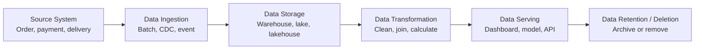

Giả sử bạn vừa đặt một phần cơm trên ứng dụng giao đồ ăn. Bạn bấm **Đặt món**, ứng dụng báo thành công, rồi khoảng ba mươi phút sau tài xế xuất hiện trước cửa.

Với bạn, giao dịch đó đã kết thúc. Với hệ thống data, nó chỉ vừa bắt đầu.

Sơ đồ dưới đây là đường đi chúng ta sẽ theo trong bài:



## Data Generation

**Data Generation** (quá trình data được tạo ra) bắt đầu khi đơn hàng được đặt. Hệ thống có thể ghi lại mã đơn, nhà hàng, món ăn, giá tiền, phương thức thanh toán và thời gian tạo đơn. Trong lúc giao hàng, nó tiếp tục nhận vị trí tài xế và các lần thay đổi trạng thái.

Data này không nhất thiết nằm cùng một chỗ. Đơn hàng có thể ở PostgreSQL, thanh toán đến từ một dịch vụ khác, còn vị trí tài xế được gửi liên tục qua event stream.

Đây là các **Source System** (hệ thống nguồn). Chúng được xây để ứng dụng hoạt động, chứ không phải để trả lời mọi câu hỏi phân tích của công ty.

Một event được tạo ra khi đơn hàng đổi trạng thái có thể trông như sau:

```json
{
  "event_id": "evt-8471",
  "event_type": "order_delivered",
  "order_id": "ORD-1042",
  "restaurant_id": "RES-18",
  "driver_id": "DRV-92",
  "occurred_at": "2026-09-06T12:32:18+08:00"
}
```

Đây là data gần với hoạt động của application: nó ghi lại một việc vừa xảy ra, chưa trả lời câu hỏi business nào cả.

## Data Ingestion

Đội vận hành muốn biết hôm nay có bao nhiêu đơn giao trễ. Đội tài chính cần đối soát thanh toán. Nhà hàng muốn xem món nào bán chạy. Nếu tất cả cùng truy vấn thẳng vào database của ứng dụng, họ có thể làm chậm hệ thống đang phục vụ khách hàng.

Vì vậy, data được đưa ra khỏi các Source System. Quá trình này được gọi là **Data Ingestion** (thu thập và đưa data vào hệ thống). Có nguồn được lấy theo lịch, chẳng hạn mỗi giờ một lần. Có nguồn gửi event ngay khi thay đổi xảy ra.

Cùng một đơn hàng có thể đi vào nền tảng data qua nhiều đường:

| Source System | Data cần lấy | Cách ingest | Thời điểm |
| --- | --- | --- | --- |
| PostgreSQL | Đơn hàng và nhà hàng | CDC | Gần như ngay khi row thay đổi |
| Payment API | Trạng thái thanh toán | Batch | Mỗi 15 phút |
| Delivery service | Vị trí và trạng thái giao hàng | Event stream | Liên tục |

Sau Data Ingestion, event ở trên vẫn nên giữ `event_id`, `order_id` và `occurred_at`. Những field này giúp pipeline nhận ra event trùng, ghép đúng đơn hàng và biết sự việc thật sự xảy ra lúc nào.

## Data Storage

**Data Storage** (lưu trữ data) cho data một nơi để sống lâu hơn Source System. Tuỳ nhu cầu, nó có thể được lưu trong **Data Warehouse** (kho dữ liệu), **Data Lake** (hồ dữ liệu) hoặc **Lakehouse** (kiến trúc kết hợp Data Warehouse và Data Lake).

Ở thời điểm này, data chưa chắc đã dễ dùng. Tên nhà hàng có thể nằm trong một bảng, thông tin đơn hàng nằm ở bảng khác, còn data thanh toán dùng một mã định danh khác hoàn toàn.

Data của `ORD-1042` có thể được lưu ở ba lớp:

| Lớp | Ví dụ data | Mục đích |
| --- | --- | --- |
| Raw | Event JSON giống Source System | Giữ lại bản gốc để kiểm tra hoặc xử lý lại |
| Cleaned | Event đúng schema, không trùng, timestamp đã chuẩn hoá | Tạo đầu vào ổn định cho các pipeline khác |
| Curated | Một row đơn hàng đã ghép payment, restaurant và delivery | Phục vụ phân tích và sản phẩm data |

Không phải hệ thống nào cũng gọi ba lớp này bằng cùng một cái tên. Điều cần nhớ là data gốc và data đã qua xử lý thường được tách ra để tránh ghi đè lên nhau.

## Data Processing and Transformation

Trong bước này, **Data Processing** (xử lý data) và **Data Transformation** (biến đổi data) được dùng để kiểm tra, làm sạch và kết hợp data. Ví dụ, một pipeline có thể:

1. Loại những lần cập nhật bị gửi trùng.
2. Chuẩn hoá tất cả thời gian về cùng múi giờ.
3. Ghép đơn hàng với nhà hàng và giao dịch thanh toán.
4. Tính thời gian từ lúc đặt món đến lúc giao thành công.
5. Tạo một bảng chỉ gồm các chỉ số mà đội vận hành cần.

Nếu bước này sai, dashboard phía sau có thể vẫn trông rất đẹp nhưng con số không còn đáng tin.

Ví dụ, pipeline nhận được ba row sau:

| order_id | status | event_time | delivery_fee |
| --- | --- | --- | ---: |
| ORD-1042 | delivered | 12:32:18 +08:00 | 18,000 |
| ORD-1042 | delivered | 12:32:18 +08:00 | 18,000 |
| ORD-1043 | delivered | 04:41:02 UTC | 22,000 |

Hai row đầu là cùng một event được gửi lại. Row cuối dùng UTC thay vì giờ Singapore. Sau khi loại trùng và chuẩn hoá timezone, pipeline mới tính được:

| delivery_date | delivered_orders | total_delivery_fee |
| --- | ---: | ---: |
| 2026-09-06 | 2 | 40,000 |

Nếu bỏ qua bước loại trùng, dashboard sẽ báo ba đơn và `58,000` tiền giao hàng dù thực tế chỉ có hai đơn.

## Data Serving

**Data Serving** (cung cấp data cho người dùng hoặc hệ thống khác) bắt đầu khi data đã ở dạng ổn định. Data Analyst có thể dùng nó để làm dashboard, Data Scientist có thể xây mô hình dự đoán thời gian giao hàng, còn một dịch vụ nội bộ có thể dùng nó để cảnh báo nhà hàng đang quá tải.

Cùng một data ban đầu có thể phục vụ nhiều nhu cầu. Data Engineer không quyết định thay tất cả những người dùng đó, nhưng cần hiểu họ cần gì để thiết kế data phù hợp.

Từ row của `ORD-1042`, các đầu ra có thể rất khác nhau:

| Người hoặc hệ thống sử dụng | Data được phục vụ |
| --- | --- |
| Operations dashboard | Số đơn giao trễ theo khu vực và nhà hàng |
| Finance report | Tổng tiền hàng, delivery fee và trạng thái đối soát |
| ETA model | Thời gian chuẩn bị món, quãng đường và thời gian giao thực tế |
| Alert service | Event cảnh báo khi một đơn chờ tài xế quá lâu |

Data Serving vì vậy không chỉ có dashboard. Đầu ra cũng có thể là table, feature, API hoặc event cho một hệ thống khác.

## Data Retention and Deletion

Theo thời gian, một phần data sẽ ít được truy cập hơn. **Data Retention** (lưu giữ data) quy định data cần được giữ trong bao lâu. Công ty có thể chuyển data cũ sang nơi lưu trữ rẻ hơn hoặc thực hiện **Data Deletion** (xoá data) theo quy định về quyền riêng tư.

Ngoài ra còn có **Metadata** (siêu dữ liệu): data đến từ đâu, ai sở hữu, pipeline nào đã thay đổi nó và dashboard nào đang sử dụng nó. Khi hệ thống lớn lên, những thông tin này giúp mọi người lần ngược được một con số thay vì đoán.

Ví dụ, công ty có thể áp dụng các quy tắc khác nhau cho từng loại data:

| Data | Retention | Sau thời hạn đó |
| --- | --- | --- |
| Vị trí chi tiết của tài xế | 30 ngày | Xoá |
| Event trạng thái đơn hàng | 1 năm | Chuyển sang storage rẻ hơn |
| Dữ liệu tài chính cần đối soát | 7 năm | Archive theo quy định |

Metadata của bảng đơn hàng cũng có thể ghi rõ owner là `data-commerce`, pipeline tạo bảng là `fct_orders_daily`, và dashboard nào đang phụ thuộc vào nó. Khi pipeline thay đổi, team biết cần kiểm tra những đầu ra nào.

## Bức tranh cần nhớ

Một data flow thường đi qua các bước:

**Source System → Data Ingestion → Data Storage → Data Transformation → Data Serving → Data Retention / Data Deletion**

Ngoài đời, đường đi hiếm khi thẳng và gọn như sơ đồ này. Pipeline có thể chạy lỗi, data đến muộn, schema thay đổi hoặc người dùng cần một cách tính mới. Phần lớn công việc Data Engineering nằm ở việc xử lý những tình huống đó.
